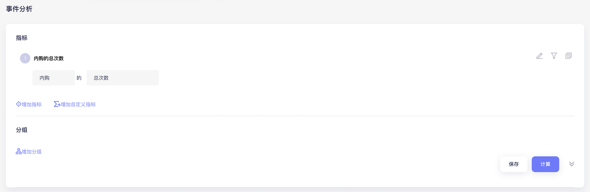
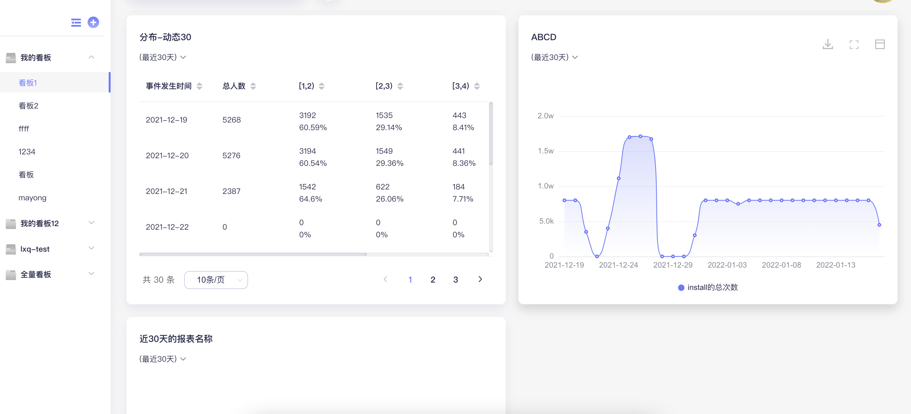

# 对接流程

在您接入热力引擎-增长云产品之前，请阅读对接流程，以确保您可以顺利接入并查看数据。

简要流程如下：

.png>)

下面将对流程进行详细说明：

### 1. 申请账号

* 通过申请内测页面申请平台账号，增长云平台将根据您申请账号时的邮箱为您开通平台登录权限
  * 账号开通时需确定当前账号汇总数据的币种（目前通过线下沟通确认）
* 申请时的邮箱将作为申请公司的“负责人”管理整个公司账号下的全部产品及子账户

### 2.创建产品

登录到后台后，需要先创建产品。

产品是指独立的一款APP，比如一款游戏；一款产品下可以有多个应用，对应多个系统平台或国内不同的应用商店包；产品在增长云平台上是最基础的分析维度。

详情参见[产品管理](san-fang-zhang-hao-jie-ru/chan-pin-guan-li.md)章节。

### 3.创建应用

创建产品后需要创建应用，应用创建在产品下。

每个应用都对应一个独立的包名，所以应用可以简单理解为一个APP包或者一个游戏包；比如Android、iOS平台可以有两个游戏包，对于安卓平台，不同应用市场要求不同包名的时候也可能对应多个游戏包，那在平台内就可以创建多个应用来分别分析；

详情参见[应用管理](san-fang-zhang-hao-jie-ru/ying-yong-guan-li.md)章节。

### 4.授权数据

将APP在各方产生的数据接入平台，目前包括投放平台、变现平台、监测平台、聚合平台和SDK/API上报的APP内的数据，其中SDK/API的数据将在下一小节详细说明；本节将对各平台对接进行简单描述。

各平台授权后，增长云会拉取各个平台上的信息，并将不同平台下的信息绑定到增长云的应用上。不同平台处理逻辑不同，所以在平台授权后，需要检查一下绑定关系，从而确保数据能计算到正确的应用和产品上。

#### 4.1 投放平台

投放平台账号授权后，增长云可以获取到投放平台上的单子、素材、成本、余额等信息。

投放平台的授权基本分为两种，通过授权API接口参数授权、通过投放平台的授权页面授权；授权后，将以小时粒度拉回平台的成本等数据。

详情参见[投放平台](san-fang-zhang-hao-jie-ru/san-fang-zhang-hao-guan-li/untitled/)章节。

#### 4.2 变现平台

变现平台账号授权后，增长云可以获取到变现平台上的收益数据。

变现平台的授权基本都是通过授权API接口参数授权的，部分平台因为报表接口中缺少拉取applist的接口，需要您同时填写cookie信息，以通过cookie拉取app。

详情参见[变现平台](san-fang-zhang-hao-jie-ru/san-fang-zhang-hao-guan-li/bian-xian-ping-tai/)章节。

#### 4.3 聚合平台

聚合平台账号授权后，增长云可以接收聚合平台回传的实时的广告展示数据、当次展示的收益等信息。

详情参见[聚合平台](san-fang-zhang-hao-jie-ru/san-fang-zhang-hao-guan-li/ju-he-ping-tai/)章节。

#### 4.4 监测平台

监测平台的数据授权到平台后，增长云可以接收监测平台回传的实时的归因数据，包括归因的渠道、单子素材信息等。

通常需要在监测平台上配置增长云的接收地址，由监测平台直接回调到增长云上。

详情参见[监测平台](san-fang-zhang-hao-jie-ru/san-fang-zhang-hao-guan-li/jian-ce-ping-tai/)章节。

### 5.数据上报

数据上报方式可分为SDK上报或API上报，两者在上报数据上并无本质区别。使用SDK上报时，SDK处理了一部分逻辑，比如APP安装、启动、退出等事件的监控，但如果通过API上报，则全部逻辑需要开发者自行处理上报。

SDK/API对接时按照应用维度对接，不同应用使用不同的appkey。

#### 5.1 了解分析模型

热力引擎-增长云的分析分为基础数据分析和自定义分析模型分析两种。当做完了小节4的授权数据后，即可以进行基础数据分析，即投产相关的大部分数据；若想分析用户在APP中的行为，比如留存、使用时长、通关情况等，需要通过SDK或者API上报事件数据。

#### 5.2 设计数据采集方案

在进行SDK集成之前，需要先设计数据的采集方案，明确采集的目标行为，进而进行有效的埋点设计。可以将埋点方案设计过程细化为：

* 梳理用户可能的应用内的浏览、点击行为，并确定行为的触发条件；
* 将每一个行为抽象为一个“事件”，并根据分析维度，抽象事件要添加的属性；
* 根据用户使用场景添加用户属性，及梳理用户属性的变更场景；
* 根据业务需求，整体完善采集方案设计。

#### 5.3 集成SDK/API

参照对接文档，集成SDK或对接上报API

* appkey需要注意是应用的appkey，而非产品的产品ID！
* 通过后台“事件分析”查询上报的事件是否有数据，或通过“数据管理-元数据管理-事件管理”页面查看是否接收到该事件的上报。如果通过SDK上报，建议开启Debug模式，实时查看打印的事件日志；
* 检查事件与属性的完整性：在“数据管理-元数据管理”页面中，查看“事件管理”页面和“事件属性”页面，对比数据采集方案，确认收到的事件名称和事件参数的正确性与完整性，若有错误或遗漏，请确保在APP上线前完成修改。

### 6.数据查看

待应用上线并累计数据后，在增长云后台即可查看数据。数据分为两种，即授权的数据和上报的数据。

* 通过授权的数据，您可以查看您的投产相关的数据；参见[效果报表](shu-ju-bao-biao/xiao-guo-bao-biao.md)、[财务报表](shu-ju-bao-biao/cai-wu-bao-biao/)页面。
* 通过上报的数据，您可以分析用户的应用内行为；您可以通过“分析”中的各个分析模型建立数据分析报表，也可以将报表添加到看板中，建立您自己的分析报告。

